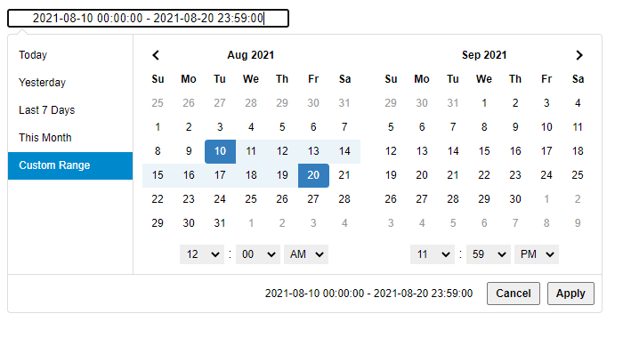

# temporal-datetimerange-picker

## Overview.
A JavaScript component that is a date &amp; time range picker, no need to build, no dependencies except the [Temporal API](https://tc39.es/proposal-temporal/docs/), that is inspired by [Dan Grossman's bootstrap-daterangepicker](https://github.com/dangrossman/daterangepicker).

Actually, this program is base on Dan Grossman's bootstrap-daterangepicker (version 3.1).
I just changed the code a bit to not need jquery.


## Requirements
- [Temporal](https://tc39.es/proposal-temporal/docs/) ships natively in modern browsers (Firefox 139+, Chrome 144+, Edge 144+). For browsers without native support yet (e.g. Safari), include the official [`@js-temporal/polyfill`](https://github.com/js-temporal/temporal-polyfill) before this library's script tag.

### Behavior without Temporal
If neither native Temporal nor the polyfill is present when a `DateRangePicker` is constructed, it does not throw or break the page. Instead, it disables the bound `<input>` and sets its value to `"Requires Temporal"`, leaving the rest of the page working normally. Calling `setStartDate`, `setEndDate`, `show`, or `updateRanges` on an instance in this state is a safe no-op. See [missing-temporal-example.html](examples/missing-temporal-example.html) for a live demo of this fallback.

### IE11
If you want to use on Internet Explorer 11, include [Polyfill](https://polyfill.io/v3/polyfill.js?ua=ie/11) to use CustomEvent, Object.assign, Element.prototype.closest and Element.prototype.matches features.


## Quick start using CDN.
1. Include the Temporal polyfill and Date Range Picker's css and js files in your webpage:
```
<link type="text/css" rel="stylesheet" href="https://cdn.jsdelivr.net/gh/Sandboxed-Forks/temporal-datetimerange-picker@latest/dist/temporal-datetimerange-picker.css">

<!-- Only needed for browsers without native Temporal support yet (e.g. Safari) -->
<script src="https://cdn.jsdelivr.net/npm/@js-temporal/polyfill/dist/index.umd.js" type="text/javascript"></script>
<script src="https://cdn.jsdelivr.net/gh/Sandboxed-Forks/temporal-datetimerange-picker@latest/dist/temporal-datetimerange-picker.js"></script>
```
2. Put "INPUT" element into "BODY", and bind DateRangePicker instance.
```
<input type="text" id="datetimerange-input1" size="24" style="text-align:center">

<script>
    window.addEventListener("load", function (event) {
        new DateRangePicker('datetimerange-input1');
    });
</script>
```

See [simple example page](examples/datetime-example-simple.html).
## Usage
```
new DateRangePicker(bindElement, options, callback);
```

| parameter | type | description |
----|----|---- 
| bindElement | string or object | bind element id or bind HTMLElement object |
| options | object | option set (see Options) |
| callback | function(date, date) | change datetime callback, 2 parameters: start and end datetime |

## Options
<details>
<summary>Almost same as Dan Grossman's bootstrap-daterangepicker Version 3.1</summary>

| name | type | description |
----|----|---- 
| startDate | Date or string | The beginning date of the initially selected date range. If you provide a string, it must match the date format string set in your locale setting.|
| endDate | Date or string | The end date of the initially selected date range.|
| minDate | Date or string | The earliest date a user may select.|
| maxDate | Date or string | The latest date a user may select. |
| maxSpan | object | The maximum span between the selected start and end dates. You can provide any Temporal duration-like object, e.g. `{ days: 9 }` (see [Temporal.Duration](https://tc39.es/proposal-temporal/docs/duration.html)). |
|showDropdowns | true/**false** | Show year and month select boxes above calendars to jump to a specific month and year. |
 minYear | number | The minimum year shown in the dropdowns when **showDropdowns** is set to true.|
| maxYear | number | The maximum year shown in the dropdowns when **showDropdowns** is set to true.|
| showWeekNumbers | true/**false** | Show localized week numbers at the start of each week on the calendars.|
| showISOWeekNumbers | true/**false** | Show ISO week numbers at the start of each week on the calendars.|
| timePicker | true/**false** | Adds select boxes to choose times in addition to dates.|
| timePickerIncrement | number | Increment of the minutes selection list for times (i.e. 30 to allow only selection of times ending in 0 or 30).|
  timePicker24Hour | true/**false** | Use 24-hour instead of 12-hour times, removing the AM/PM selection.|
| timePickerSeconds | true/**false** | Show seconds in the timePicker. |
| ranges | object |Set predefined date ranges the user can select from. Each key is the label for the range, and its value an array with two dates representing the bounds of the range. See example code.|
| showCustomRangeLabel | **true**/false | Displays "Custom Range" at the end of the list of predefined ranges, when the ranges option is used. This option will be highlighted whenever the current date range selection does not match one of the predefined ranges. Clicking it will display the calendars to select a new range. |
| alwaysShowCalendars | true/**false** | Normally, if you use the ranges option to specify pre-defined date ranges, calendars for choosing a custom date range are not shown until the user clicks "Custom Range". When this option is set to true, the calendars for choosing a custom date range are always shown instead. |
| opens | 'left'/**'right'**/'center' | Whether the picker appears aligned to the left, to the right, or centered under the HTML element it's attached to. |
| drops | **'down'**/'up'/'auto' | Whether the picker appears below (default) or above the HTML element it's attached to. |
| buttonClasses | string | CSS class names that will be added to both the apply and cancel buttons.|
| applyButtonClasses | string | CSS class names that will be added only to the apply button.|
| cancelButtonClasses | string | CSS class names that will be added only to the cancel button. |
| singleDatePicker | true/**false** | Show only a single calendar to choose one date, instead of a range picker with two calendars. The start and end dates provided to your callback will be the same single date chosen.|
| autoApply | true/**false** | Hide the apply and cancel buttons, and automatically apply a new date range as soon as two dates are clicked.|
| linkedCalendars | **true**/false | When enabled, the two calendars displayed will always be for two sequential months (i.e. January and February), and both will be advanced when clicking the left or right arrows above the calendars. When disabled, the two calendars can be individually advanced and display any month/year.|
| isInvalidDate | function(date) | A function that is passed each date in the two calendars before they are displayed, and may return true or false to indicate whether that date should be available for selection or not.|
| isCustomDate | function(date) | A function that is passed each date in the two calendars before they are displayed, and may return a string or array of CSS class names to apply to that date's calendar cell.|
| autoUpdateInput | **true**/false | Indicates whether the date range picker should automatically update the value of the &lt;input&gt; element it's attached to at initialization and when the selected dates change.|
| parentEl | string | the parent element that the date range picker will be added to, if not provided this will be 'body'|
| locale | object ||
| locale.format | string | date time text locale format like "YYYY年MM月DD日 HH時mm分ss秒".|
| locale.separator | string | separator between 2 date times. default separator is "**-**"|
| locale.applyLabel | string | label text of the apply button. default is "**Apply**"|
| locale.cancelLabel | string | label text of the cancel button. default is "**Cancel**"|
| locale.weekLabel | string | label text of week number column like "**W**"|
| locale.daysOfWeek | array of 7 strings | 7 label texts of week column like **['Su', 'Mo', 'Tu', 'We', 'Th', 'Fr', 'Sa']** |
| locale.monthNames | array of 12 strings | 12 label texts of month nameweek column. like **['Jan', 'Feb', 'Mar', 'Apr', 'May', 'Jun', 'Jul', 'Aug', 'Sep', 'Oct', 'Nov', 'Dec']** |
| locale.firstDay | number | 0 = from Sunday, 1 = from Monday, ..., 6 = from Saturday |
> **strong text value** means default value.

</details>


## Methods
<details>
<summary> You can programmatically update the startDate and endDate in the picker using the setStartDate and setEndDate methods. You can access the Date Range Picker object and its functions and properties through data properties of the element you attached it to.</summary>

| name | type | description |
----|----|---- 
| setStartDate | Date or string | Sets the date range picker's currently selected start date to the provided date |
| setEndDate | Date or string | Sets the date range picker's currently selected end date to the provided date |

### Usage
```
    let drp = new DateRangePicker('datetimerange-input1', { alwaysShowCalendars: true });,
    drp.setStartDate('2014/03/01');
    drp.setEndDate('2014/03/03');
```
</details>

## Events
<details>
<summary> Several events are triggered on the element you attach the picker to, which you can listen for.</summary>

| name |  description |
----|---- 
| show.daterangepicker | Triggered when the picker is shown |
| hide.daterangepicker | Triggered when the picker is hidden |
| showCalendar.daterangepicker | Triggered when the calendar(s) are shown |
| hideCalendar.daterangepicker | Triggered when the calendar(s) are hidden |
| apply.daterangepicker |Triggered when the apply button is clicked, or when a predefined range is clicked |
| cancel.daterangepicker |Triggered when the cancel button is clicked |

### Usage
```
    window.addEventListener('apply.daterangepicker', function (ev) {
        console.log(ev.detail.startDate.format('YYYY-MM-DD'));
        console.log(ev.detail.endDate.format('YYYY-MM-DD'));
    });
```
</details>

## Examples
### Data Time Range Picker with a Callback.


```
<input type="text" id="datetimerange-input1" size="40" style="text-align:center">

<script>
    var Temporal = window.Temporal || window.temporal.Temporal;

    function startOfDay(t) { return t.with({ hour: 0, minute: 0, second: 0, millisecond: 0, microsecond: 0, nanosecond: 0 }); }
    function endOfDay(t) { return t.with({ hour: 23, minute: 59, second: 59, millisecond: 999, microsecond: 999, nanosecond: 999 }); }

    window.addEventListener("load", function (event) {
        var now = Temporal.Now.plainDateTimeISO();
        new DateRangePicker('datetimerange-input1',
            {
                timePicker: true,
                opens: 'left',
                ranges: {
                    'Today': [startOfDay(now), endOfDay(now)],
                    'Yesterday': [startOfDay(now.subtract({ days: 1 })), endOfDay(now.subtract({ days: 1 }))],
                    'Last 7 Days': [startOfDay(now.subtract({ days: 6 })), endOfDay(now)],
                    'This Month': [startOfDay(now.with({ day: 1 })), endOfDay(now.with({ day: now.daysInMonth }))],
                },
                locale: {
                    format: "YYYY-MM-DD HH:mm:ss",
                }
            },
            function (start, end) {
                alert(start.format() + " - " + end.format());
            })
    });
</script>
```
See [datetime example page](/examples/datetime-example.html)

## Extra
### A Dark Version CSS


change
```
<link type="text/css" rel="stylesheet" href="https://cdn.jsdelivr.net/gh/Sandboxed-Forks/temporal-datetimerange-picker@latest/dist/temporal-datetimerange-picker.css">
```
to
```
<link type="text/css" rel="stylesheet" href="https://cdn.jsdelivr.net/gh/Sandboxed-Forks/temporal-datetimerange-picker@latest/extra/temporal-datetimerange-picker-dark.css">
```

See [datetime dark example page](/examples/datetime-example-dark.html)</a>.

### Dynamic DataRange Change (since 0.2.0)
you can change dateranges dynamically.
with extra function ```updateRanges(Object)```

See [datetime example page](/examples/datetime-example.html)</a>.


## Credits

This library is a fork of a fork:

- **[Dan Grossman](https://www.daterangepicker.com/)** created the original jQuery-based [bootstrap-daterangepicker](https://github.com/dangrossman/daterangepicker) that this whole lineage is built on &mdash; the calendar rendering, options, and events all trace back to his work. Special thanks to him for it.
- **[Alumuko](https://github.com/alumuko)** forked Dan's picker into [vanilla-datetimerange-picker](https://github.com/alumuko/vanilla-datetimerange-picker), removing the jQuery dependency in favor of plain JavaScript (while still relying on Moment.js for date handling). This repo was forked from Alumuko's version.
- This repo, **temporal-datetimerange-picker**, forks Alumuko's version again to remove the Moment.js dependency in favor of the [Temporal API](https://tc39.es/proposal-temporal/docs/). It's named `temporal-datetimerange-picker` &mdash; rather than keeping the `vanilla-datetimerange-picker` name &mdash; specifically so it isn't confused with Alumuko's still-active, Moment.js-based original.

## License
 [MIT License](LICENSE)
